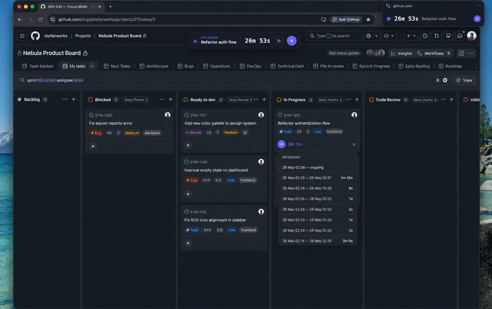

# GitHub Issues Time Tracker

A Chrome extension to help you stay focused on one issue at a time and easily track the time you invest in each one — directly from your **GitHub Projects board**, no external tools, no context switching.



---

## Features

### ▶ Per-card timer

Every card on your GitHub Projects board gets a small timer widget at the bottom. Click the play button to start focusing, click pause to stop. Simple as that.

- **Grey** — no time recorded yet
- **Green** — time recorded, timer stopped
- **Indigo** — timer is currently running

Only one timer can be active at a time. Starting a new one automatically pauses the previous.

A short sound plays when the timer starts and when it stops.

---

### 📋 Session history

Tracked time is stored as individual sessions (start + end timestamp), not just a total. Hover over a card widget and click the **☰** icon to see a breakdown of all sessions:

- Start and end time for each session
- Duration per session
- Active session shown as "ongoing"
- Sessions ordered from most to least recent

---

### 🟣 Floating bar

While a timer is running, a pill-shaped bar appears at the top center of the page showing:

- **FOCUSING** label
- The issue title
- Live elapsed time
- A **pause button** to stop the timer
- A **⧉ button** to open the Picture-in-Picture window

The browser tab title also updates in real time:

```
5m 30s — Fix login redirect
```

The original title is restored when the timer stops.

---

### 🖥 Picture-in-Picture window

Click **⧉** in the floating bar to open an always-on-top mini window that floats above everything — even other apps.

- Shows a slow-pulsing dot + live timer
- Expand the window to also show the issue title
- Includes a **pause button** so you can stop the timer without going back to the browser
- Automatically closes when the timer is stopped

> Requires Chrome 116+ and must be opened via a direct click (browser security requirement).

---

### 🔔 Extension badge

The extension icon in the Chrome toolbar shows a live badge with the elapsed time while a timer is running. Useful when GitHub is in a background tab.

---

### ⏹ Extension popup

Click the extension icon in the toolbar to open a small popup. If a timer is running, it shows:

- The issue title
- Live elapsed time
- A **Stop timer** button

If no timer is running, it simply says so.

---

### 🎉 Celebration

Hover over any card widget that has tracked time to reveal a **🎉** button. Click it to fire a confetti burst and a short fanfare — a small reward for getting the work done.

---

## Installation

This extension is not published to the Chrome Web Store yet. Install it manually in developer mode:

1. Clone or download this repository
2. Open Chrome and go to `chrome://extensions`
3. Enable **Developer mode** (top right toggle)
4. Click **Load unpacked**
5. Select the root folder of this repository

---

## How time is stored

Time is saved in `localStorage` under keys prefixed with `gitt:` followed by the card's internal GitHub board ID.

Each entry stores an array of sessions:

```json
{
  "issueRef": "owner/repo/issues/42",
  "sessions": [
    { "start": 1748000000000, "end": 1748003600000 },
    { "start": 1748010000000, "end": null }
  ]
}
```

- `end: null` means the session is currently active
- Total time and running state are derived from the sessions array — never stored separately
- Entries are only created when you first press play on a card

> **Note:** data is stored locally in the browser. It is not synced across devices or Chrome profiles.

---

## Compatibility

- Chrome 116+ (required for Document Picture-in-Picture API)
- Works on `github.com` project boards (GitHub Projects v2)

---

## Known limitations

- **Local storage only** — session data lives in `localStorage` for the GitHub domain. Clearing browser data will erase all tracked time.
- **One board at a time** — if you have multiple GitHub Projects tabs open, the active timer state may conflict between tabs.
- **GitHub markup dependency** — the extension relies on GitHub's DOM structure. If GitHub updates its Projects UI, some selectors may need updating. The selector tests (see below) will catch breakage early.

---

## Selector tests

The extension relies on specific GitHub DOM selectors. If GitHub changes its markup, these tests will tell you exactly which selector broke and what to fix.

### Setup (required once, and whenever GitHub updates its markup)

1. Open a GitHub Projects board in Chrome
2. Open DevTools → Elements tab
3. Right-click on `<html>` → **Copy** → **Copy outerHTML**
4. Paste the content into `tests/fixtures/board.html`

> `board.html` is git-ignored — it must be generated locally.

### Run

```
npm install
npm test
```

---

## Ideas for the future

- **Timer on issue pages** — inject the widget directly on `/issues/123` pages, not just on the board, for people who work from the issue view
- **Timer on pull requests** — track time spent reviewing PRs on `/pull/123` pages; code review is invisible work worth measuring
- **Meeting timer in the popup** — a dedicated button to track time spent in meetings, separate from issue work, to understand the meeting vs. deep work ratio over time
- **Daily history in the popup** — a view of everything you tracked today with total time per issue/PR, and the ability to navigate back and forward by day for retrospectives
